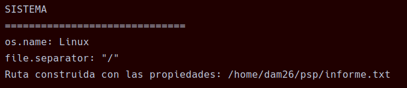
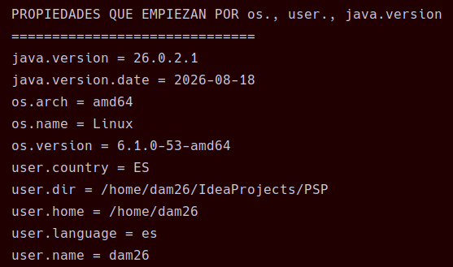
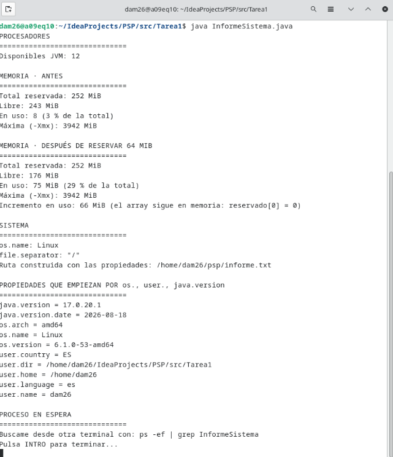
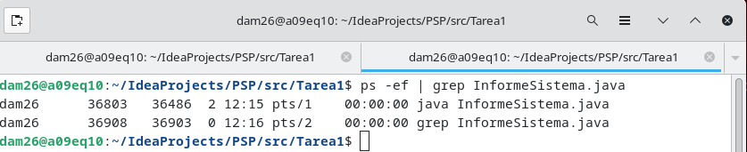
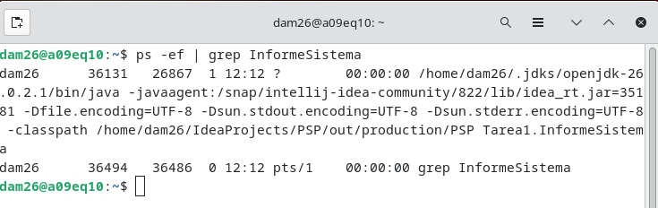
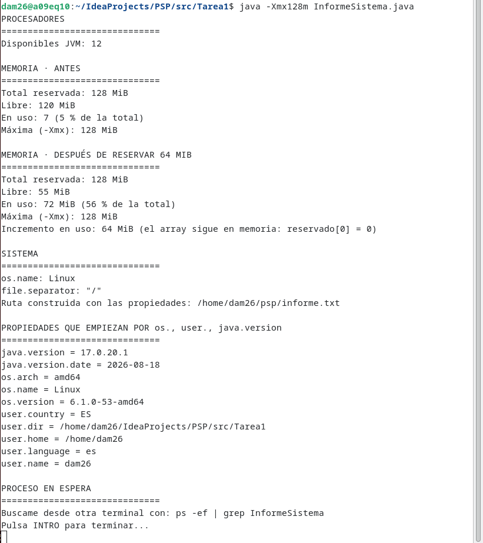

# Tarea 01 - Radiografía del sistema

**Módulo:** Programación de servizos e procesos  
**Curso:** 2026-2027  
**Alumno** René Chamorro Crugeiras  

---

## 1. Objetivo

El objetivo de esta práctica es crear un programa Java que muestre información sobre el sistema, la memoria de la JVM y las propiedades del sistema.

---

## 2. Procesadores

El programa muestra el número de procesadores disponibles para la JVM utilizando:

```java
Runtime runtime = Runtime.getRuntime();
int procesadores = runtime.availableProcessors();
```

Quedaría así:

```java
Runtime runtime = Runtime.getRuntime();

        int procesadores = runtime.availableProcessors();

        System.out.println("PROCESADORES");
        System.out.println("==============================");
        System.out.println("Disponibles JVM: " + procesadores);
```
### Muestra:


---

## 3. Memoria

Se muestra:

* Memoria total.
* Memoria libre.
* Memoria utilizada.
* Memoria máxima.
* Porcentaje de memoria utilizada.


Después se reserva aproximadamente **64 MiB**:

```java
long[] reservado = new long[8 * 1024 * 1024];
```

Se vuelve a medir la memoria y se calcula el incremento.


---

## 4. Sistema operativo y ruta

Se utilizan las propiedades del sistema para obtener el sistema operativo, el separador de archivos y el directorio personal.

La ruta de `informe.txt` se construye de forma multiplataforma:

```text
user.home/psp/informe.txt
```



---

## 5. Propiedades del sistema

El programa muestra las propiedades que empiezan por:

```text
os.
user.
java.version
```

Si se pasan otros prefijos como argumentos, utiliza esos prefijos.

Las propiedades se muestran ordenadas alfabéticamente.



---

## 6. PID y PPID

Esto se muestra por la consola de la terminal al ejecutar el código:



Mientras el programa está esperando INTRO, se busca desde otra terminal con:

```bash
ps -ef | grep InformeSistema
```

El **PID** identifica al proceso y el **PPID** identifica al proceso padre.



También se ejecuta desde el IDE para comparar el PPID.



---

## 7. Memoria con -Xmx128m

Se ejecuta:

```bash
java -Xmx128m InformeSistema
```

`-Xmx128m` limita la memoria máxima del heap a aproximadamente 128 MiB.

Se comparan los resultados con una ejecución normal.



---

## 8. Programación concurrente, paralela y distribuida

### a) Servidor web con 500 peticiones

Se puede utilizar programación **concurrente y paralela** para atender varias peticiones.

**Inconveniente:** puede aumentar el consumo de memoria.

### b) Renderizar una película

Se puede utilizar programación **paralela y distribuida**, repartiendo los fotogramas entre varios núcleos u ordenadores.

**Inconveniente:** hay que coordinar los diferentes equipos.

### c) Descargar un archivo mientras se navega

Se utiliza programación **concurrente**, realizando la descarga en segundo plano.

**Inconveniente:** hay que controlar correctamente la comunicación entre la descarga y la interfaz.

### d) Cálculo que no cabe en la RAM

Se puede utilizar programación **distribuida**, repartiendo los datos entre varios ordenadores.

**Inconveniente:** la comunicación entre ordenadores puede ser lenta.

---

## 9. Conclusión

Con esta práctica he aprendido a consultar información de la JVM, controlar el uso de memoria, obtener propiedades del sistema y localizar procesos mediante PID y PPID.

También he visto las diferencias entre programación concurrente, paralela y distribuida.
