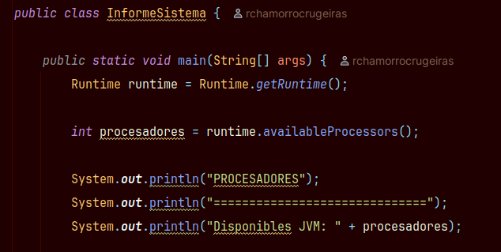

# Tarea 01 - Radiografía del sistema

**Módulo:** Programación de servizos e procesos  
**Curso:** 2026-2027  
**Alumno** René Chamorro Crugeiras  

---

## 1. Objetivo

El objetivo de esta práctica es crear un programa Java que muestre información sobre el sistema, la memoria de la JVM y las propiedades del sistema.

---

## 2. Procesadores

El programa muestra el número de procesadores disponibles para la JVM utilizando:

```java
Runtime runtime = Runtime.getRuntime();
int procesadores = runtime.availableProcessors();
```

### Captura



---