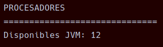
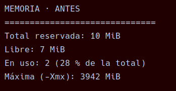
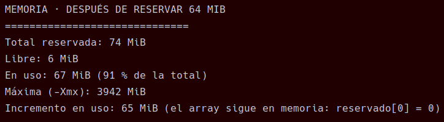

# Tarea 01 - Radiografía del sistema

**Módulo:** Programación de servizos e procesos  
**Curso:** 2026-2027  
**Alumno** René Chamorro Crugeiras  

---

## 1. Objetivo

El objetivo de esta práctica es crear un programa Java que muestre información sobre el sistema, la memoria de la JVM y las propiedades del sistema.

---

## 2. Procesadores

El programa muestra el número de procesadores disponibles para la JVM utilizando:

```java
Runtime runtime = Runtime.getRuntime();
int procesadores = runtime.availableProcessors();
```

Quedaría así:

```java
Runtime runtime = Runtime.getRuntime();

        int procesadores = runtime.availableProcessors();

        System.out.println("PROCESADORES");
        System.out.println("==============================");
        System.out.println("Disponibles JVM: " + procesadores);
```
### Muestra:



---

## 3. Memoria

Se muestra:

* Memoria total.
* Memoria libre.
* Memoria utilizada.
* Memoria máxima.
* Porcentaje de memoria utilizada.



Después se reserva aproximadamente **64 MiB**:

```java
long[] reservado = new long[8 * 1024 * 1024];
```

Se vuelve a medir la memoria y se calcula el incremento.



---
