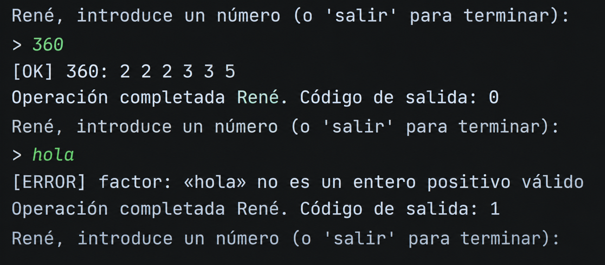
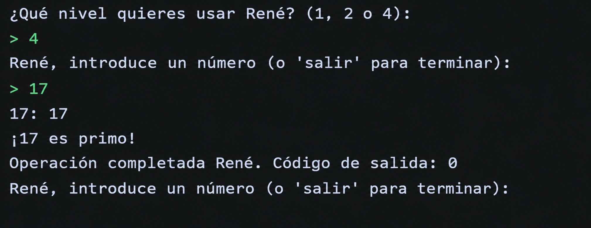

# Tarea 05 - Auditoría Cósmica: El Detector de Primos

**Módulo:** Programación de servizos e procesos  
**Curso:** CFGS DAM 2 - 2026/2027  
**Alumno:** René Chamorro Crugeiras  

## 1. Clases utilizadas

El programa está formado por dos clases:

* `Interfaz.java`: se encarga de pedir los números al usuario y seleccionar el nivel.
* `Lanzador.java`: ejecuta el comando `factor` y procesa su resultado.

## 2. Niveles realizados

He realizado los cuatro niveles de la práctica:

* **Nivel 1:** ejecuta `factor`, muestra su salida y el código de salida.
* **Nivel 2:** muestra la salida con `[OK]` o `[ERROR]`.
* **Nivel 3:** guarda la salida en `factor_output.log` y los errores en `factor_error.log`.
* **Nivel 4:** comprueba si el número introducido es primo.

## 3. Funcionamiento

Al iniciar el programa se pregunta qué nivel queremos utilizar:

```text
¿Qué nivel quieres usar René? (1, 2, 3 o 4):
> 4
```

Después se introduce un número:

```text
René, introduce un número (o 'salir' para terminar):
> 17
17: 17
¡17 es primo!
Operación completada. Código de salida: 0
```

El programa continúa pidiendo números hasta que se escribe:

```text
salir
```

Entonces termina:

```text
Saliendo del programa
```

## 4. Pruebas

| Valor  | Salida de factor                                 | Código de salida |
| ------ | ------------------------------------------------ | ---------------- |
| `360`  | `360: 2 2 2 3 3 5`                               | `0`              |
| `1`    | `1: `                                            | `0`              |
| `17`   | `17: 17`                                         | `0`              |
| `hola` | `factor: 'hola' is not a valid positive integer` | `1`              |
| `-5`   | `factor: '-5' is not a valid positive integer`   | `1`              |

## 5. Capturas

### Número correcto



### Número incorrecto y Nivel 4

### Nivel 4



## 6. Error encontrado

Durante la realización de la práctica tuve un problema al ejecutar el comando `factor`, ya que el programa no mostraba correctamente la salida.

Lo solucioné utilizando `ProcessBuilder` para ejecutar el comando y `BufferedReader` para leer la salida normal y la salida de errores.

Después de realizar estos cambios, el programa mostró correctamente el resultado y el código de salida.

## 7. Conclusión

Con esta práctica he aprendido a crear procesos externos desde Java utilizando `ProcessBuilder`, leer su salida y código de salida, trabajar con archivos `.log` y comprobar si un número es primo mediante la salida del comando `factor`.
