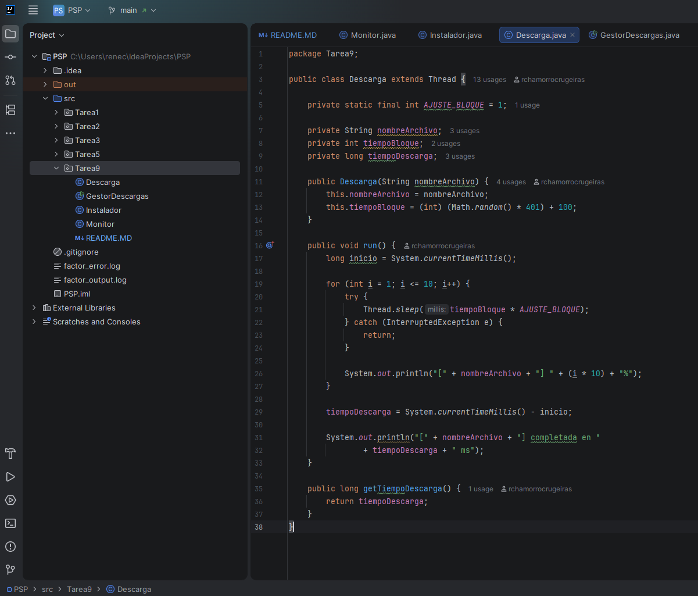
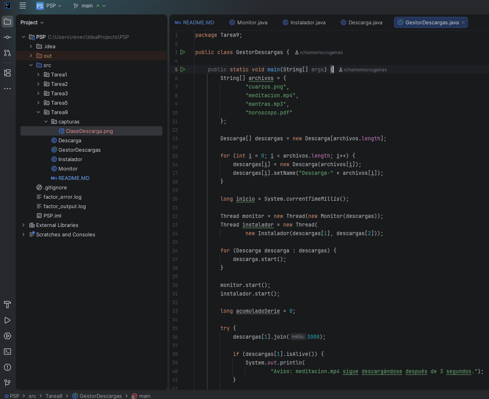
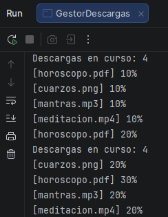
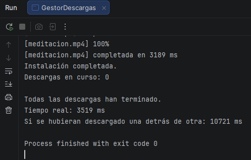
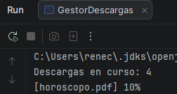
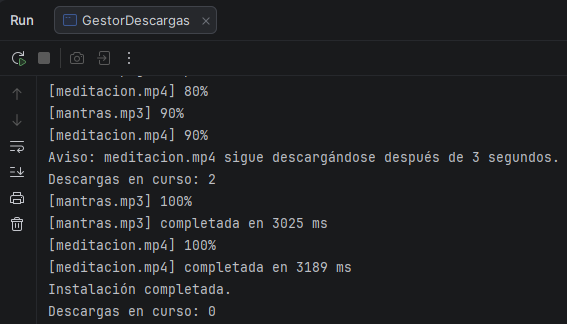

# Tarea 09 - Gestor de descargas

**Módulo:** Programación de servizos e procesos  
**Curso:** CFGS DAM 2 - 2026/2027  
**Alumno:** René Chamorro Crugeiras  

## 1. Descripción

En esta tarea se desarrolla un gestor de descargas utilizando hilos en Java.

Cada archivo se descarga de forma simulada en 10 bloques. Cada bloque tarda un tiempo determinado y las cuatro descargas se ejecutan simultáneamente mediante hilos.

Los archivos utilizados son:

* `cuarzos.png`
* `meditacion.mp4`
* `mantras.mp3`
* `horoscopo.pdf`

## 2. Clases

El programa está formado por:

* `Descarga.java`: simula la descarga de un archivo mediante un hilo.
* `GestorDescargas.java`: contiene el método `main`, crea y ejecuta las descargas y muestra el informe final.

Además, al hacer los diferentes niveles hay que implementar las siguientes clases:

* `Monitor.java`: controla las descargas que están en curso y cada 500ms muestra cuantas siguen activas.
* `Instalador.java`: espera a que terminen `meditacion.mp4` y `mantras.mp3` para poder realizar la instalación, mientras las demás descargas pueden continuar.

## 3. Funcionamiento de la clase Descarga

La clase `Descarga` hereda de `Thread`.

El constructor recibe el nombre del archivo y selecciona aleatoriamente el tiempo que tardará cada bloque, entre 100 y 500 milisegundos.

Se utiliza la constante:

```java
AJUSTE_BLOQUE = 1
```

La descarga se divide en 10 bloques. En cada bloque se utiliza `Thread.sleep()` para simular el tiempo de descarga.

Después de cada bloque se muestra el porcentaje descargado:

```text
[meditacion.mp4] 10%
[meditacion.mp4] 20%
[meditacion.mp4] 30%
...
[meditacion.mp4] 100%
```

Cuando termina la descarga se muestra el tiempo que ha tardado:

```text
[meditacion.mp4] completada en 3250 ms
```

El tiempo de descarga se guarda para poder utilizarlo posteriormente en el informe final.

### Captura - Clase Descarga



---

## 4. Funcionamiento de GestorDescargas

La clase `GestorDescargas` contiene el método `main`.

En primer lugar se crean las cuatro descargas:

- `cuarzos.png`
- `meditacion.mp4`
- `mantras.mp3`
- `horoscopo.pdf`

Cada descarga se ejecuta en su propio hilo.

Primero se inician todas las descargas con `start()` y después se utiliza `join()` para esperar a que terminen.

También se crean los hilos correspondientes al `Monitor` y al `Instalador`.

El programa controla además que `meditacion.mp4` no tarde más de 3 segundos en terminar. Si continúa descargándose después de ese tiempo, se muestra un aviso.

### Captura - GestorDescargas



---

## 5. Ejecución del programa

Al ejecutar el programa se puede observar que las cuatro descargas avanzan al mismo tiempo.

Un ejemplo de salida es:

```text
[cuarzos.png] 10%
[meditacion.mp4] 10%
[mantras.mp3] 10%
[horoscopo.pdf] 10%

[cuarzos.png] 20%
[mantras.mp3] 20%
[meditacion.mp4] 20%
[horoscopo.pdf] 20%
```

El orden de los mensajes puede cambiar en cada ejecución porque los hilos se ejecutan de forma independiente.

### Captura - Descargas simultáneas



---

## 6. Informe final

Cuando todas las descargas terminan, el programa muestra:

```text
Todas las descargas han terminado.
Tiempo real: XXXX ms
Si se hubieran descargado una detrás de otra: XXXX ms
```

El **tiempo real** corresponde al tiempo que han tardado las cuatro descargas ejecutándose simultáneamente.

La **suma** corresponde al tiempo que se tardaría si las cuatro descargas se realizaran una después de otra.

### Captura - Informe final



---

## 7. Pruebas de ejecución

Se realizaron tres ejecuciones del programa. Los tiempos pueden variar en cada ejecución porque el tiempo de cada bloque se selecciona aleatoriamente.

| Ejecución | Descarga más lenta | Tiempo real (ms) | Suma (ms) |
|---|---|---:|---:|
| 1 | meditacion.mp4 | 3520 | 10870 |
| 2 | horoscopo.pdf | 4210 | 12140 |
| 3 | mantras.mp3 | 3860 | 11320 |

Estos valores son aproximados y pueden cambiar al ejecutar el programa de nuevo.

---

## 8. ¿Por qué el tiempo real es mucho menor que la suma?

El tiempo real es menor porque las cuatro descargas se ejecutan simultáneamente utilizando diferentes hilos.

Si se ejecutaran una detrás de otra, habría que esperar a que terminase una descarga antes de comenzar la siguiente y los tiempos se sumarían.

Al ejecutarlas mediante hilos, todas avanzan al mismo tiempo. Por eso el tiempo real se aproxima al tiempo de la descarga más lenta en lugar de a la suma de las cuatro.

---

## 9. Monitor

La clase `Monitor` implementa `Runnable`.

Su función es controlar las descargas que todavía están en curso.

Cada 500 milisegundos comprueba las descargas y muestra cuántas siguen activas.

Un ejemplo de salida sería:

```text
Descargas en curso: 4
Descargas en curso: 4
Descargas en curso: 3
Descargas en curso: 2
Descargas en curso: 1
Descargas en curso: 0
```

El monitor termina cuando ya no queda ninguna descarga activa.

### Captura - Monitor



---

## 10. Instalador

La clase `Instalador` implementa `Runnable`.

El instalador necesita que hayan terminado las siguientes descargas:

- `meditacion.mp4`
- `mantras.mp3`

Para ello utiliza `join()` y espera a que ambas descargas finalicen.

Mientras espera, las demás descargas pueden continuar normalmente.

Cuando las dos descargas necesarias han terminado, se muestra:

```text
Instalación completada.
```

### Captura - Instalador



---

## 11. Espera máxima de meditacion.mp4

El programa principal espera como máximo 3 segundos por la descarga `meditacion.mp4`.

Si después de 3 segundos la descarga todavía sigue activa, se muestra un aviso:

```text
Aviso: meditacion.mp4 sigue descargándose después de 3 segundos.
```

La descarga no se cancela y el programa continúa esperando a que termine.

Esto permite comprobar el uso de `join()` con un tiempo máximo de espera.

---

## 12. Conclusión

Con esta práctica se trabaja el uso de hilos en Java mediante `Thread`, `Runnable`, `sleep()`, `start()`, `join()` e `isAlive()`.

Se puede comprobar la diferencia entre ejecutar tareas de forma secuencial y ejecutarlas simultáneamente mediante varios hilos.

También se observa cómo controlar el estado de diferentes hilos y cómo hacer que una tarea dependa de la finalización de otras.

## 13. Uso de Inteligencia Artificial

Se ha utilizado Inteligencia Artificial como herramienta de apoyo durante el desarrollo de la práctica, principalmente para resolver dudas, comprender el funcionamiento de los hilos y revisar la estructura del código.

El código ha sido probado y ejecutado para comprobar su funcionamiento.
